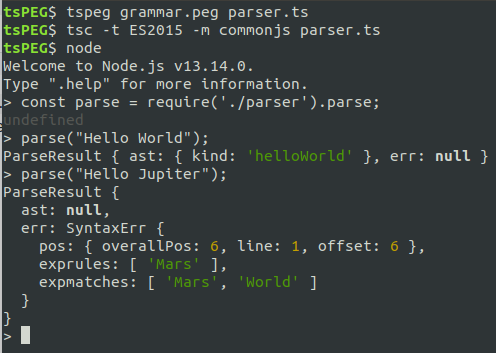
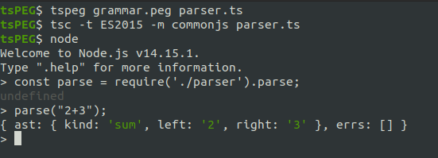
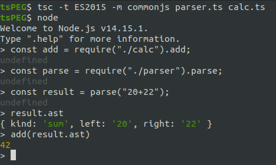
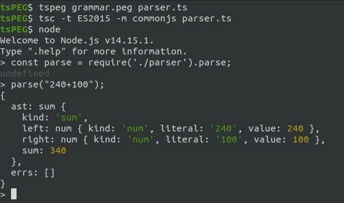
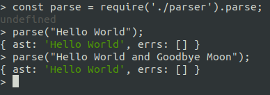
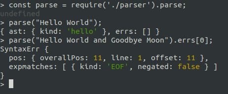

# tsPEG : A PEG Parser Generator for TypeScript

*tsPEG* is a PEG Parser generator for TypeScript. *tsPEG* takes in an intuitive description of a grammar and outputs a fully featured parser that takes full advantage of the TypeScript type system.

## Installation

`tspeg` can be installed by running

```
npm install -g tspeg
```

## Features

- Fully featured PEG support, more powerful than CFGs.
- Infinite lookahead parsing, no restrictions.
- Regex based lexing, implicit tokenisation in your grammar specification.
- Tight typing, generates classes for all production rules, differentiable using discriminated unions.
- Memoisation (packrat parsing) support for guaranteed `O(n)` parse times.

## CLI Usage

The CLI invocation syntax is as follows

`tspeg <grammar-file> <output-file>`

This generates a TypeScript ES6 module that exports a parse function, as well as classes that
represent your AST.

Run `tspeg --help` to see usage and available flags.

Flags supported:

- `--enable-memo`: Enable [memoisation](#memoisation); Get better performance at the expense of
  increased memory usage.
- `--num-enums`: Use numeric enums instead of strings for AST kinds. Slightly reduces memory
  footprint of syntax trees.

## Parser Usage

The generated module exports a `parse` function that accepts an input string, and returns a
`ParseResult` object like this:

```TypeScript
class ParseResult {
    ast: START | null;
    errs: SyntaxErr[];
}

export function parse(input: string): ParseResult {
    ...
}
```

If the `errs` field is non-empty, then syntax errors were found, otherwise the AST is stored in
the `ast` field. (`START` will be replaced with the type of your starting grammar rule).

## Grammar Syntax

*tsPEG* grammars are specified with a simple syntax, similar to the classic EBNF syntax.

Grammars are composed of a sequence of rules, each rule defines what text that it should match, using regex literals, names of rules, and powerful [operators](#operators) like `|` for choice.

Each rule is defined by a name, followed by a `:=` sign and then a "rule description". Rule descriptions are easiest seen by example here:

```
hello := 'Hello '
helloWorld := hello 'World'
helloChoice := hello 'Mars' | helloWorld
```

- The first line defines a rule `hello` which matches the string 'Hello ' directly.
- The next line defines the rule `helloWorld`, this rule first matches our first rule `hello`, then matches the string 'World', i.e it matches the string "Hello World".
- The third line uses the `|` operator to make a choice between two options.
    1. First this rule will try to match the left hand side of the operator: `hello 'Mars'`, which as before will first match the rule `hello`, then the regex literal `Mars`.
    2. If this left hand side fails, we move on to trying the right hand side, which is just a reference to the `helloWorld` rule.
    In practice this means it either matches "Hello World" or "Hello Mars"

*tsPEG* **starts parsing with the first rule in the grammar** so to match the `helloChoice` rule we should either move it to the start or defined a `start` rule that points to it like this:

```
start := helloChoice
hello := 'Hello '
helloWorld := hello 'World'
helloChoice := hello 'Mars' | helloWorld
```

Putting this grammar into a file called "grammar.peg" and running `tspeg grammar.peg parser.ts` we get our parser for this simple grammar in the file "parser.ts". We can compile this (target at least es2015) and load it into NodeJS to test it.



As you can see we get no errors for 'Hello World', and 'Hello Mars', this means the match was successful. But when we try 'Hello Jupiter' we get do get an error in the error list. It lists the location of the error, and the expected matches at that location, namely it expected to have a regex match for 'Mars' or 'World'. You can see more about errors in the [Syntax Error section.](#syntax-errors)

Notably the `ast` field of the parse result is empty for 'Hello World' and 'Hello Mars', it only contains a `kind` field that tell us which rule was matched. ([See more on kinds](#kind-checking)). This is because we haven't told *tsPEG* what elements of the grammar we would like to be returned. When we write a rule definition, we can specify the fields we'd like to save in the AST by assigning them with an `=` sign. For example, say we want to match a string that's the sum of 2 numbers, e.g. "2+3", "123+456", we'd like to save both side of the sum in our AST, we can do this by writing a grammar like the following. *Note that we had to write '\\+' to escape the '+' symbol as the '+' symbol has special meaning in regex*.

```
sum := left=num '\+' right=num
num := '[0-9]+'
```

Running *tsPEG* on this input and testing the parser in node we can see that the parser result has saved the left and right numbers of our sum. Note that we didn't have to assign the result of the `[0-9]+` rule in the `num` rule. This is because rules that are just references to other rules are saved implicitly.



Now that we have saved the numbers of our sum, it's easy to write a program to compute the result of adding the numbers. Each rule that assigns results to the AST is exported as a class or interface with the same name as the rule, so we can just import the `sum` interface from the parser to write our function. For this grammar we get an interface like:

```TypeScript
interface sum {
    left: string;
    right: string;
}
```

Allowing us to write our calculator function like:

```TypeScript
import { sum } from "./parser";

export function add(ast: sum): number {
    return parseInt(ast.left) + parseInt(ast.right);
}
```

Calling this file "calc.ts" we can use it to calculate our sums:



We can also use [computed properties](#computed-properties) to calculate the result of the sum during the parsing process.

## Operators

*tsPEG* supports a set of powerful operators to build complex grammars. The only operator we have seen so far is the `|` operator, which allows us to make choices between two rule expressions, however there are many more.

- The `?` operator is used to make a match optional. For example in the rule
    ```
    rule := 'I ' 'really '? 'love tsPEG'
    ```
    The match for the 'really ' string has been marked optional, so this rule can match either "I really love tsPEG", or "I love tsPEG".

- The `+` operator matches 1 or more copies of the match it's applied to, for example:
    ```
    rule := 'It\'s a ' 'long '+ 'way away'
    ```
    This rule matches "It's a long way away", "It's a long long way away", etc. for any amount of "long"s that's not 0. When this operator is used, a list of results is attached to the AST.

- The `*` operator is the same as the `+` operator but it allows zero matches.
- The `!` is called the "*negative lookahead*" operator, and it does exactly what it says on the tin. This operator inverts the result of the match, meaning you can specify a rule by what it should not match. For example the rule
   ```
   rule := 'The banned word is ' !'Macbeth' '[a-zA-Z]+'
   ```
   This will match the phrase "The banned word is X" for any value of X, except when X is 'Macbeth'
- The `&` operator is called the "*postitive lookahead*" operator, this operator will change a match so that it will test for the match, and fail if it doesn't work, but it will not consume the input. This allows you to lookahead at what comes next in the string, but not to consume it.

## Sub-rules

Inline sub-rules can be specified in *tsPEG*. These use the `{` and `}` brackets for grouping, and allow you to write smaller rules inline in a larger rule. For example
```
rule := 'start' {some optional part}? 'finish'
```
We want the part in the middle to be optional, so we wrap it in `{` and `}` and apply the `?` operator. The `{}` brackets create a sub-rule. Note that if you want to assign the subrules values to the tree you do need to assign a name to it e.g. `rule := 'start' middle={some optional part}? 'finish'`.

## Syntax Errors

A `SyntaxErr` object is composed of two fields, a `pos` field with the position of the error, and `expmatches` which contains a list of expected matches. It also supports a `toString` method to return a readable text error message. (In production though it is recommended to use a more ad-hoc custom method).

Matches can be either a `RegexMatch`, or an `EOFMatch`. These can be disambiguated by checking the `kind` field (not the same as the AST `kind` fields). Each type contains a field "negated" denoting whether the match was expected to be successful or unsuccessful (e.g. if the `!` operator was used).

`RegexMatch` objects are for attempts at matching regex literals, these are the most common. `EOFMatch` objects are for attempts at matching the `EOF` (`$`) match (See the [section on EOF matching](#eof-matching)).

The definitions for each are below:

See details of the `PosInfo` object in the [Position Tracking section.](#position-tracking).

```TypeScript
interface RegexMatch {
    kind: "RegexMatch";
    negated: boolean;
    literal: string;
}

type EOFMatch = { kind: "EOF"; negated: boolean };

type MatchAttempt = RegexMatch | EOFMatch;

interface PosInfo {
    overallPos: number;
    line: number;
    offset: number;
}

class SyntaxErr {
    public pos: PosInfo;
    public expmatches: MatchAttempt[];
    public toString(): string {
        // ...
    }
}
```

## Comments

C-style comments can be added to grammar spec files. Anything on a line after a // is a comment, and
is ignored by the generator.

## Computed Properties

As well as assigning parsing results to variables and storing them on the AST, *tsPEG* also allows you to create **computed properties**, which are fields on the AST that are computed when the parser is run.

Computed properties are added to a rule by appending a new expression after the rule description like
```
.<propertyname> = <type> { <code to calculate property> }
```

Returning to our sum example from earlier we had a grammar to match strings like "2+3", "40+200" etc.
```
sum := left=num '\+' right=num
num := '[0-9]+'
```
We can add computed properties to this to compute the value of this sum at parse time, instead of writing our own function to do it after. First we add a computed property to `num` to store the value of the number:
```
sum := left=num '\+' right=num
num := literal='[0-9]+'
       .value = number { return parseInt(this.literal); }
```

As you can see we've assigned the text match to the field `literal`, and added a computed property called `value` which is the `literal` field parsed as an integer.

Now we can add a computed property to `sum` to do the arithmetic, this is very simple
```
sum := left=num '\+' right=num
       .sum = number { return this.left.value + this.right.value }
num := literal='[0-9]+'
       .value = number { return parseInt(this.literal); }
```

We use the computed property of the `num` rule to compute our `sum` property. Let's see this in action! Let's try and parse the string "240+100".



As you can see the AST has a field called `sum` with the correct value of 340 in it. The `left` and `right` also have their computed `value` properties of 240 and 100.

## Header

The introduction of computed properties means that now you might want to import some types or functions into your parser. Luckily you can specify a header in the file that will be inserted directly into the generated parser. Anything at the top of the grammar file between two lines of three dashes `---` will be inserted straight into the generated parser, allowing you to write grammars like

```
---
import { myFunc, myType } from "./mypackage";
---
rule := hello='Hello World'
        .value = myType { return myFunc(this.hello); }
```

## Kind Checking

*tsPEG* uses [discriminated unions](https://www.typescriptlang.org/docs/handbook/advanced-types.html#discriminated-unions) to distinguish between types of AST nodes. Each AST node type has a field called `kind` which contains some value from the `ASTKinds` enum. This `kind` field can be used to differentiate between AST results.

### Example

```
Choice := Word | Int
Word   := word='[a-z]+'
Int    := val='[0-9]+'
```

When writing a function to process the parse tree for this grammar, you can check if `kind === ASTKinds.Word` or `kind === ASTKinds.Int` to see which rule was matched.

```TypeScript
import { Choice, Parser, ASTKinds } from  "./parser";

function makeChoice(c: Choice) {
    if(c.kind === ASTKinds.Word) {
        console.log('Matched word ', c.word)
    } else {
        console.log('Matched int ', c.val)
    }
}
```

### Kind names
The names of the ASTKinds enum entries vary.

- For simples rules like `Rule := name='regex'` the kind will be `ASTKinds.Rule`.
- For rules with multiple choices such as `Rule := choiceA='regexA' | choiceB='regexB'` the `kind` will either be one of `ASTKinds.Rule_1` or `ASTKinds.Rule_2` depending on which rule was matched. In general they are of the form `ASTKinds.<RuleName>_N` for the `N`th choice.
- Rules that directly reference a different rule like `rule := otherrule` don't get their own AST type, so inherit the `kind` from the other rule.
- Sub-rules are given the kind `ASTKinds.<ParentRule>_$N` for the `N`th subrule of rule `ParentRule`. For example in the rule `Rule := sub={ name='regex' }` the `kind` for the sub-rule is `ASTKinds.Rule_$0`.
- If in doubt it's simple to inspect the generated parser file to find what the correct kind name is. The compiler will also be sure to tell you when you're wrong.

## Position tracking

tsPEG supports a special match expression "`@`" for storing the positions of matches. Using `@` you can store the current position of the parser.

The `@` expression returns a `PosInfo` object:

```TypeScript
export interface PosInfo {
    // overallPos is the index of the input string
    readonly overallPos: number;

    // line is the line of the input
    readonly line: number;

    // offset is the number of characters from the
    // start of the line
    readonly offset: number;
}
```

### Example

Returning to our addition of two numbers from earlier, which matches "12+56", "123+456" etc.

```
sum := left=num '\+' right=num
num := '[0-9]+'
```

If we want to store the location of the "+" operator we can use the @ match like this:

```
sum := left=num pluspos=@ '\+' right=num
num := '[0-9]+'
```

This stores the position of the parser into the AST before the '+' symbol, the generated interface for the AST looks like:

```TypeScript
interface sum {
    left: string
    pluspos: PosInfo
    right: string
}
```

## EOF Matching

tsPEG supports another special match expression `$` that matches the end of the input (traditionally referred to as `EOF` for End-Of-File).

The `$` match will succeed only if we are at the end of the input. This can be used to ensure that all of the input is consumed.

### Example

Consider this grammar:

```
hello := 'Hello World'
```

This grammar will successfully match the string "Hello World" as expected, *but* it will also match the string "Hello World, Goodbye Moon". It will match the "Hello World" at the start of sentence and not try to go any further.



To fix this issue we can use the `$` symbol to require that the parser only succeeds if the EOF has been reached.

```
hello := 'Hello World' $
```

If the EOF is not matched by the parser you will get an `EOFMatch` object in your expected matches in the returned `SyntaxErr`.



## Memoisation

If your generated parser speed is slow, it might be due to excessive backtracking being required to
parse your input.

Memoisation can be enabled to solve this problem. By passing the flag `--enable-memo` to tsPEG,
your generated parser will cache partial parsing results as it goes, which can drastically improve
parse times, at the expense of increasing the parsers memory usage.
